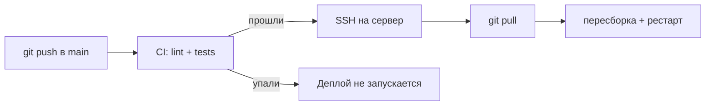

# Автодеплой через CI/CD (GitHub Actions)

Третий способ развернуть обновления — в дополнение к [`DEPLOY.md`](./DEPLOY.md) (вручную) и [`DOCKER.md`](./DOCKER.md) (Docker Compose), а не вместо них.

**Это способ автоматизировать ОБНОВЛЕНИЯ уже настроенного сервера, а не первоначальную настройку.** Сервер должен быть уже один раз поднят по DEPLOY.md либо DOCKER.md — CI/CD дальше просто избавляет от ручного захода по SSH при каждом изменении кода.

## Как это работает



Пуш в `main` → GitHub Actions гоняет тесты (уже настроено в `.github/workflows/ci.yml`) → если тесты прошли, отдельный job подключается к серверу по SSH, обновляет код и пересобирает/перезапускает приложение. Если тесты упали — деплой не запускается вообще, сломанный код на прод не попадёт.

Без настроенных секретов (см. ниже) job деплоя просто помечается как **skipped** — это ожидаемое поведение, не ошибка (например, на форках репозитория).

## Шаг 1. Разовая настройка на сервере

На уже настроенном сервере (после DEPLOY.md либо DOCKER.md) — один раз укажите способ деплоя:

```bash
cd /var/www/app   # или другой путь, куда клонирован репозиторий

# Если сервер настроен по DEPLOY.md (Node + pm2 напрямую):
echo pm2 > .deploy-mode

# Если по DOCKER.md (docker compose):
echo docker > .deploy-mode
```

Файл `.deploy-mode` не в git — это характеристика конкретного сервера, а не кода (см. `scripts/deploy-remote.sh`, он же выполняется CI при каждом деплое).

## Шаг 2. Отдельный SSH-ключ для деплоя

Не переиспользуйте свой личный ключ — сделайте отдельный, чтобы его можно было отозвать, не трогая свой доступ:

```bash
ssh-keygen -t ed25519 -C "github-actions-deploy" -f deploy_key -N ""
```

Появятся два файла: `deploy_key` (приватный, для GitHub) и `deploy_key.pub` (публичный, для сервера).

На сервере добавьте публичный ключ тому пользователю, от имени которого будет заходить CI (можно тому же, что и для ручного деплоя):

```bash
cat deploy_key.pub >> ~/.ssh/authorized_keys
```

## Шаг 3. Секреты в GitHub

Репозиторий на GitHub → **Settings → Secrets and variables → Actions → New repository secret**. Добавьте:

| Имя секрета | Значение |
|---|---|
| `DEPLOY_HOST` | IP-адрес или домен сервера |
| `DEPLOY_USER` | Имя пользователя для SSH (тот, кому добавили ключ на шаге 2) |
| `DEPLOY_SSH_KEY` | Содержимое **приватного** ключа целиком — `cat deploy_key`, вставить весь вывод включая строки `-----BEGIN ... KEY-----`/`-----END ... KEY-----` |
| `DEPLOY_PATH` | Абсолютный путь к склонированному репозиторию на сервере (например `/var/www/app`) |
| `DEPLOY_PORT` | *(опционально)* SSH-порт, если не стандартный 22 |

После сохранения `DEPLOY_SSH_KEY` посмотреть его снова через интерфейс GitHub нельзя — только пересоздать секрет заново, если понадобится.

## Шаг 4. Проверка

Запушьте что-нибудь в `main` (или откройте вкладку **Actions** → workflow **CI** → **Run workflow** для ручного запуска без пуша) и проверьте job **Deploy to production** в логе. Если что-то не так с SSH-доступом — ошибка будет прямо в логе шага «Deploy via SSH».

## Безопасность

- Ключ из шага 2 даёт доступ только на деплой — если он утечёт, отзовите его на сервере (`~/.ssh/authorized_keys`) и пересоздайте, не трогая остальной доступ.
- По возможности заведите для деплоя отдельного пользователя без root-прав, с доступом только к папке проекта и командам из `scripts/deploy-remote.sh`.
- `DEPLOY_SSH_KEY`/`DEPLOY_HOST` — секреты, не переменные (Variables) — они не показываются в логах и не читаются повторно через интерфейс GitHub даже вам самим.
