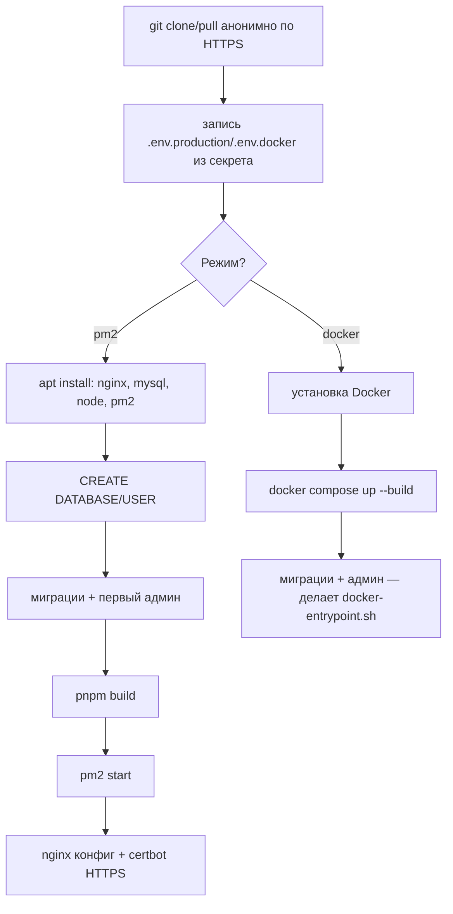

# Полностью автоматический деплой с нуля (GitHub Actions)

Третий, полностью самостоятельный способ — в отличие от [`DEPLOY.md`](./DEPLOY.md) и [`DOCKER.md`](./DOCKER.md), не требует ничего делать на сервере руками вообще. Один клик в GitHub Actions превращает **пустой** сервер Ubuntu 24.04 в полностью работающий сайт с HTTPS: системные пакеты, база данных, первый администратор, сборка, nginx/certbot (или Docker-стек) — всё по шагам DEPLOY.md/DOCKER.md, просто автоматически.

**После первого успешного запуска дальнейшие обновления идут через уже существующий `deploy` job в `.github/workflows/ci.yml`** (см. [`CI_CD.md`](./CI_CD.md)) — provisioning использует те же секреты `DEPLOY_HOST`/`DEPLOY_USER`/`DEPLOY_SSH_KEY`/`DEPLOY_PATH`, поэтому обычный пуш в `main` после этого сразу начинает автодеплоиться, ничего дополнительно настраивать не нужно.

## Что должно быть готово заранее

- Пустой (или почти пустой) сервер **Ubuntu 24.04**, root/sudo-доступ по SSH.
- Домен с A-записью, уже указывающей на IP сервера (см. DEPLOY.md, шаг 0) — нужно и для pm2-режима (certbot), и для docker-режима (Caddy).
- На сервере уже должен быть добавлен публичный ключ пользователя, от чьего имени будет заходить GitHub Actions (`ssh-copy-id` или вручную в `~/.ssh/authorized_keys`) — этот шаг сам provisioning не делает, это вход НА сервер, а не то, что он настраивает.

## Секреты в GitHub

Repository → **Settings → Secrets and variables → Actions**. Часть секретов совпадает с [`CI_CD.md`](./CI_CD.md) — если уже заводили их там, повторно создавать не нужно.

| Секрет | Значение | Уже был в CI_CD.md? |
|---|---|---|
| `DEPLOY_HOST` | IP/домен сервера | да |
| `DEPLOY_USER` | SSH-пользователь | да |
| `DEPLOY_SSH_KEY` | Приватный ключ для входа НА сервер | да |
| `DEPLOY_PATH` | Куда клонировать репозиторий (например `/var/www/app`) | да |
| `DEPLOY_PORT` | SSH-порт, если не 22 (опционально) | да |
| `DOMAIN` | Домен сайта, например `example.com` (без `https://` и без `www.`) | нет — новый |
| `CERTBOT_EMAIL` | Email для Let's Encrypt (только pm2-режим — уведомления об истечении сертификата) | нет — новый |
| `ENV_PRODUCTION` | **Всё** содержимое будущего `.env.production` целиком (только pm2-режим) | нет — новый |
| `ENV_DOCKER` | **Всё** содержимое будущего `.env.docker` целиком (только docker-режим, включает и `DOMAIN` для Caddy) | нет — новый |

Заводите либо `ENV_PRODUCTION`, либо `ENV_DOCKER` — в зависимости от того, какой режим выберете при запуске (см. ниже), второй не нужен.

Этот репозиторий публичный — `git clone` на сервере проходит анонимно по HTTPS, отдельный `GITHUB_DEPLOY_KEY` не нужен и в workflow не используется. Актуально только для приватных форков/копий (в приватном исходном репозитории этот шаг есть).

### `ENV_PRODUCTION` / `ENV_DOCKER` — как подготовить

Скопируйте [`.env.example`](./.env.example) (для pm2) или [`.env.docker.example`](./.env.docker.example) (для docker), заполните реальными значениями **сразу с `https://`** в `NEXTAUTH_URL`/`NEXT_PUBLIC_SITE_URL` (в отличие от ручного DEPLOY.md, тут не нужна временная http-стадия — сертификат получается в рамках того же запуска, ДО того как сайт реально начнёт обслуживать запросы). Про `YANDEX_*`/капчу — см. [`YANDEX_SETUP.md`](./YANDEX_SETUP.md). Весь получившийся файл целиком (все строки) — значение секрета.

## Как запустить

GitHub → вкладка **Actions** → workflow **Provision new server** → **Run workflow** → выбрать `mode` (`pm2` или `docker`) → **Run workflow**.

Занимает несколько минут (загрузка Node/nvm, `pnpm install`, сборка, certbot). Следить за прогрессом — в логе job'а `provision`, шаги подписаны по номерам (`[provision] 1/9: ...` и т.д.).

## Что именно происходит

## После provisioning — вручную (как и в DEPLOY.md/DOCKER.md)

Автоматизировать это осознанно не стали — реальные данные бизнеса вводит человек, не скрипт:

- `/admin/login` под учёткой из `BOOTSTRAP_ADMIN_EMAIL`/`BOOTSTRAP_ADMIN_PASSWORD` (из вашего `ENV_PRODUCTION`/`ENV_DOCKER`).
- Главная — название/адрес/телефон отеля, логотип, hero-изображение.
- SEO — заголовки, соцсети, координаты, счётчик Яндекс.Метрики.
- Настройки → секретное слово для восстановления пароля.

## Безопасность и на что обратить внимание

- Workflow запускается **только вручную** (`workflow_dispatch`) — намеренно, чтобы случайный пуш не начал переустанавливать пакеты и трогать nginx/certbot на боевом сервере.
- Скрипты написаны с оглядкой на повторный запуск (`CREATE DATABASE IF NOT EXISTS`, идемпотентные миграции и `admin:bootstrap`, `ln -sf`), но рассчитаны прежде всего на **первый** запуск на пустом сервере — не гоняйте их постоянно "на всякий случай" на уже работающем проде.
- И pm2-, и docker-режим собирают приложение (`pnpm build` / `docker build`) **прямо на сервере** — тот же лимит по RAM (~1.5–2 ГБ), что и в DEPLOY.md/DOCKER.md. На сервере с меньшим объёмом RAM сначала добавьте своп (см. пример в CI_CD.md) — иначе сборка упадёт на шаге 6/9 (pm2) или на `docker compose up --build` (docker).
