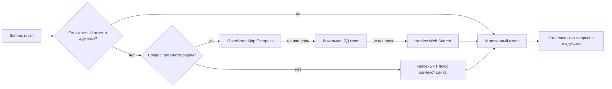
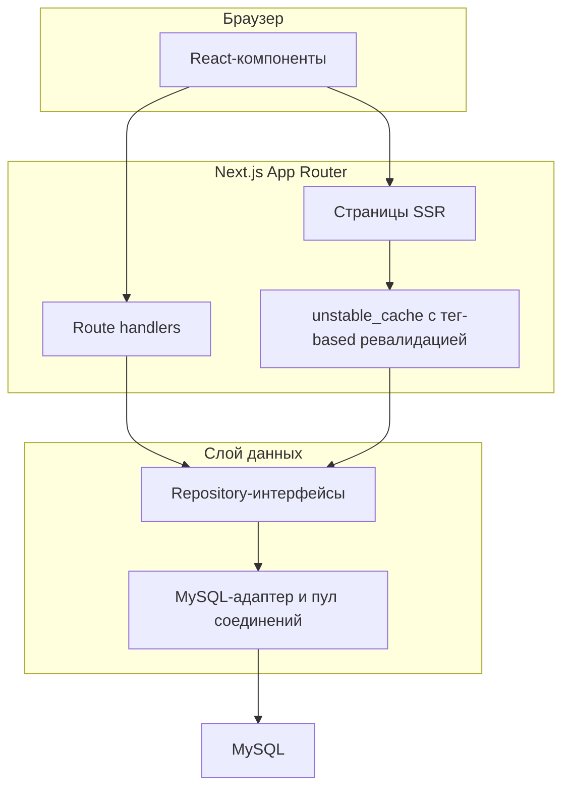

# Recepto

**Готовый сайт-движок для гостиничного бизнеса: онлайн-бронирование, полная админ-панель без единой строки кода и AI-консьерж, интегрированный со всем сайтом.**

> Это не конструктор сайтов с drag-and-drop — это готовое, продакшен-проверенное приложение (Next.js 16 + MySQL), которое разворачивается за один вечер под новый объект (отель, гостевой дом, апартаменты) и дальше полностью живёт через админку: тексты, номера, цены, SEO, тема оформления и переписка AI-консьержа с гостями.
>
> Портфолио-версия этого репозитория. Реальный проект развёрнут для действующего отеля — здесь вся бизнес-специфика (фото, контакты, координаты) заменена на демо-данные, история коммитов и код структурно идентичны боевой версии.

---

## Содержание

- [Что умеет сайт](#что-умеет-сайт)
- [AI-консьерж](#ai-консьерж)
- [Админ-панель](#админ-панель)
- [Технологии](#технологии)
- [Архитектура](#архитектура)
- [Безопасность](#безопасность)
- [Тесты и качество](#тесты-и-качество)
- [Деплой](#деплой)
- [Структура репозитория](#структура-репозитория)

---

## Что умеет сайт

### Публичная часть

- **Каталог номеров** по категориям, с фильтрами по датам/гостям и карточками номеров (галерея, удобства, тарифы).
- **Карточка номера как модальное окно поверх каталога** — переход с карточки открывает номер поверх текущей страницы (без потери прокрутки и состояния фильтров), но URL при этом настоящий, кликабельный и открывается как обычная отдельная страница при прямом переходе или обновлении (Next.js parallel + intercepting routes, `@modal/(.)[category]/[roomId]`).
- **Бронирование** — форма заявки с проверкой дат заезда/выезда, вместимости (взрослые/дети) и капчой (Yandex SmartCaptcha); заявка уходит на почту с защитой от случайных повторных отправок (отложенная на 2 минуты отправка с возможностью отмены).
- **Гибкое ценообразование** — калькулятор цены по номеру: базовый тариф + конструктор формул для доплат за дополнительных гостей, сезонность и т.д., без деплоя нового кода при изменении правил.
- **Карта окрестностей** — ближайшие кафе/аптеки/магазины/достопримечательности, часть — из собственной БД (курируется в админке), часть — живым запросом к OpenStreetMap Overpass API.
- **Динамический SEO**: title/description на каждую страницу, Open Graph-изображения, которые **рендерятся на лету** (логотип, название, фото номера — прямо в PNG для соцсетей), JSON-LD структурированные данные (schema.org/Hotel), sitemap.xml и robots.txt собираются из актуальных данных БД, а не лежат статикой.
- **Тема оформления** — вся цветовая палитра сайта (включая OG-картинки) — набор CSS custom properties, редактируемых в реальном времени из админки, без пересборки.

### AI-консьерж

Чат-виджет отвечает на вопросы гостей, полностью интегрирован с данными сайта:



- **Контекст всего сайта** — модель получает актуальные номера, категории, тарифы и настройки отеля из БД при каждом ответе, а не статичный промпт.
- **Самообучение через админку**: вопросы, на которые чат не смог ответить уверенно, попадают в раздел «Неотвеченные вопросы» — админ видит их и добавляет быстрые ответы/уточняет FAQ, не трогая код.
- **Быстрые ответы** — кнопки-подсказки (что умеет бот, показать номера, забронировать, как добраться, позвонить) редактируются из админки.
- **Устойчивость к промпт-инъекциям** — эвристический фильтр на известные формулировки атак, лимит длины сообщения и истории диалога.
- **Rate limiting** на уровне IP, отдельно от лимитера форм.

## Админ-панель

Полное управление сайтом без доступа к коду — 10+ разделов:

| Раздел | Что настраивает |
|---|---|
| **Номера** | CRUD номеров через модальную форму, drag-and-drop сортировка фото, категории, вместимость; массовое обновление цены сразу для всех номеров категории — отдельной модалкой, без правки каждого номера вручную |
| **Категории** | Категории номеров, максимальная вместимость по категории |
| **Удобства** | Удобства номеров со своими SVG-иконками (с санитайзером на XSS, см. ниже) |
| **Цены и тарифы** | Каталог тарифов + визуальный конструктор формулы доплат за гостей |
| **Места рядом** | Точки на карте (кафе, аптеки, магазины, достопримечательности) — добавление и правка через модальную форму |
| **Чат-бот** | Тексты ответов, быстрые ответы, неотвеченные вопросы, места для чата |
| **Главная страница** | Hero-изображение, логотип/название, контакты, соцсети |
| **Палитра** | Цветовая тема сайта в реальном времени |
| **SEO** | Title/description по страницам, OG-настройки, Яндекс.Вебмастер/Метрика |
| **Настройки окружения** | Просмотр/редактирование переменных окружения, секретное слово для восстановления пароля |

Технически — все клиентские компоненты на React 19, общаются с `/api/admin/**` через единую обёртку для HTTP-запросов, загрузка файлов — через переиспользуемый хук.

## Технологии

- **Next.js 16** (App Router, React 19, React Compiler) — SSR/ISR под капотом, `unstable_cache` с тег-based ревалидацией из админки
- **MySQL** через `mysql2` — свой слой доступа к данным по паттерну Repository (без ORM), с транзакциями
- **NextAuth** (Credentials + JWT) — сессии администратора
- **YandexGPT** — прямой fetch к API, без дополнительных AI SDK
- **Yandex SmartCaptcha** — защита форм от ботов
- **Vitest** — 86 тестовых файлов (unit/component/integration), запуск в CI на каждый push/PR
- **Docker** — production docker-compose (приложение + MySQL + Caddy с автоматическим HTTPS) как альтернатива классическому деплою через pm2 + nginx

## Архитектура



- **Repository-паттерн** для всех сущностей (номера, категории, удобства, места, настройки) — интерфейс отдельно от MySQL-реализации, что делает БД заменяемой и упрощает моки в тестах.
- **buildSafe()** — сборка (`next build`) может выполняться в окружении вообще без доступа к БД (например, отдельная сборка Docker-образа перед доставкой на маленький сервер); чтение настроек на этой фазе аккуратно откатывается на пустые дефолты вместо падения всей сборки, не маскируя при этом реальные сбои БД в рантайме.
- **Кэш с тег-based инвалидацией** — админка при сохранении дёргает `revalidateTag`, обновляя только затронутые данные, без сброса всего кэша сайта.

## Безопасность

Часть решений, закрытых в рамках отдельного адверсиального аудита (сохранены как регресс-тесты):

- **SVG-санитайзер** для иконок удобств, загружаемых через админку — фильтрует `<script>`, обработчики событий, `javascript:`-ссылки, числовые ссылки на символы и вложенные конструкции обхода.
- **Восстановление пароля администратора** через секретное слово — глобальный rate-limit (не по IP, чтобы нельзя было обойти сменой адреса), сравнение через `bcrypt.compare` без временных side-channel утечек.
- **CSP** (Content-Security-Policy), защита от clickjacking, строгая валидация всех admin-эндпоинтов через Zod-схемы.
- **Устойчивость к host confusion** в чат-боте — ссылки на Яндекс.Карты в ответах ИИ проверяются на реальный allowlist домена, а не на вхождение подстроки.
- Валидация бронирования на сервере (не только на клиенте): минимум взрослых гостей, порядок дат заезда/выезда, потолок вместимости по категории.

## Тесты и качество

- 86 тестовых файлов (Vitest): 85 unit/component (моки, без внешних зависимостей, гоняются на каждый `pnpm test`) + отдельный интеграционный тест против настоящего MySQL.
- GitHub Actions — два независимых job'а на каждый push и pull request в `main`: lint + unit/component, и отдельно интеграционные тесты с поднятым MySQL-контейнером.
- TypeScript strict — `tsc --noEmit` без ошибок на протяжении всей разработки.

## Деплой

Два готовых, задокументированных до последней команды способа:

- **[`DOCKER.md`](./DOCKER.md)** — `docker compose up`, три сервиса (приложение, MySQL, Caddy с автоматическим Let's Encrypt HTTPS). Минимум ручных действий.
- **[`DEPLOY.md`](./DEPLOY.md)** — классический способ с нуля: Node, MySQL, nginx + certbot, pm2 с защитой от OOM на маленьких серверах (учтён случай VPS с < 1 ГБ RAM).

Оба пути покрывают одно и то же: миграции БД, создание первого администратора без ручных SQL-вставок пароля, первый вход и заполнение реальных данных.

## Структура репозитория

```
src/
  app/          Роуты App Router: публичные страницы, /admin, /api/**
  components/   React-компоненты — см. src/components/README.md
    admin/      Компоненты админ-панели — см. src/components/admin/README.md
  hooks/        Переиспользуемые хуки — см. src/hooks/README.md
  lib/          Утилиты client/server/shared — см. src/lib/README.md
  db/           Слой доступа к данным (repository-паттерн) — см. src/db/README.md
  schemas/      Zod-схемы валидации admin-эндпоинтов
  types/        TypeScript-типы домена — см. src/types/README.md
  styles/       Глобальные SCSS-токены, миксины, reset
  test/         Общие моки и setup для Vitest
migrations/mysql/  SQL-миграции схемы
scripts/           Служебные Node-скрипты (миграция БД, бутстрап админа и т.д.)
Dockerfile, docker-compose.prod.yml, Caddyfile  Docker-развёртывание — см. DOCKER.md
```

Подробнее по каждой части:

- [`src/components/README.md`](./src/components/README.md)
- [`src/components/admin/README.md`](./src/components/admin/README.md)
- [`src/hooks/README.md`](./src/hooks/README.md)
- [`src/lib/README.md`](./src/lib/README.md)
- [`src/db/README.md`](./src/db/README.md)
- [`src/types/README.md`](./src/types/README.md)

## Разработка

```bash
pnpm install

pnpm dev            # dev-сервер
pnpm build          # production-сборка
pnpm start          # production-сервер (после build)

pnpm lint           # ESLint
pnpm test           # Vitest (одноразовый прогон)
pnpm test:watch     # Vitest в watch-режиме
pnpm test:coverage  # Vitest с покрытием

pnpm db:migrate      # применяет ВСЕ миграции migrations/mysql/*.sql по порядку
pnpm admin:bootstrap # создаёт первого администратора (только на чистой БД)
```

> **Миграции:** `pnpm db:migrate` применяет все файлы `migrations/mysql/NNN_*.sql` по порядку, отслеживая уже применённые в таблице `schema_migrations` — безопасно перезапускать. `seed-places.sql`/`seed-chat.sql` — демо-данные, накатываются вручную и по желанию.

## Переменные окружения

Полный список — в [`.env.example`](./.env.example).

| Группа | Переменные |
|---|---|
| БД | `DB_HOST`, `DB_PORT`, `DB_USER`, `DB_PASSWORD`, `DB_NAME` |
| Auth | `NEXTAUTH_SECRET`, `NEXTAUTH_URL` |
| Первый админ (разово) | `BOOTSTRAP_ADMIN_EMAIL`, `BOOTSTRAP_ADMIN_PASSWORD` |
| Почта | `SMTP_HOST`, `SMTP_PORT`, `SMTP_USER`, `SMTP_PASS`, `MAIL_FROM`, `MAIL_TO` |
| YandexGPT | `YANDEX_FOLDER_ID`, `YANDEX_API_KEY` |
| SmartCaptcha | `YANDEX_CAPTCHA_SERVERKEY`, `NEXT_PUBLIC_YANDEX_CAPTCHA_SITEKEY` |

Как получить значения для YandexGPT и SmartCaptcha в консоли Yandex Cloud (с нюансами вроде обязательного списка доменов для капчи) — в [`YANDEX_SETUP.md`](./YANDEX_SETUP.md).

---

<sub>Портфолио-версия реального проекта — фото, контакты и брендинг заменены на демо-данные, код и функциональность не сокращены.</sub>
